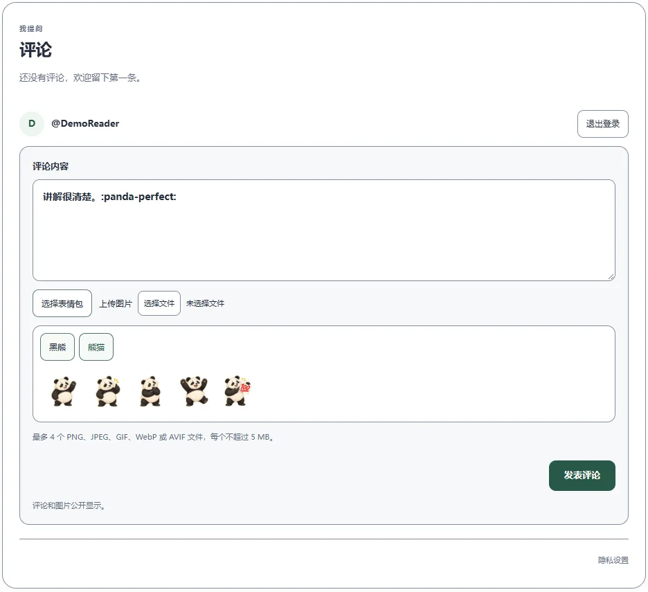

# 我提问

我提问是可独立部署的评论服务；英文界面使用官方名称 iask。它负责评论编辑器、登录、语言、响应式布局、配色适配、无障碍、贴纸、附件与服务端校验。网站只需注册可选服务并放置通用插槽。



## 部署选择

按可用免费额度优先推荐 **Cloudflare Workers**，其次 **Netlify**。详细数值、额度共享方式、停机条件和官方来源见 [平台比较](platforms.md)，核对日期为 2026-10-04。

Cloudflare 使用原生持久化 Durable Objects，不需要外接数据库。README 的部署按钮创建新仓库副本和独立 Worker。网站与评论服务分别部署，服务平台配置 GitHub App 私钥及 Client Secret，切勿把密钥放入网站或聊天。

Netlify 的按钮使用仓库 `netlify.toml`，自动识别 `@netlify/database` 并配置内置数据库，部署时执行已提交的 SQL migration。无需另开数据库账号或手动填写数据库连接串。免费积分由部署、函数、数据库计算和流量共同消耗，数据库醒来后的空闲时间也计费；它适合低频使用，不能把 300 积分解释为整月常驻数据库。当前生产环境仍使用 Cloudflare，Netlify 尚未进行真实账号部署与数据库读写验收。

Vercel 适配器保留给已有 PostgreSQL 的运营者，不列为推荐一键方案。网站前端可独立托管于 Cloudflare、Vercel、Netlify、腾讯 EdgeOne Pages 或阿里云 ESA Pages。

## GitHub App 与服务配置

1. 建立开启 Issues 的 GitHub 仓库，将 GitHub App 安装到该仓库，并按 [完整部署指南](deployment.md) 配置所需权限。
2. 配置 `COMMENTNEST_SITE_ORIGIN` 为评论服务的精确 HTTPS 来源，`COMMENTNEST_WEBSITE_ORIGIN` 为网站精确来源，`COMMENTNEST_REPOSITORY` 为 `owner/repository`。
3. 配置 App ID、Client ID、完整 PEM 私钥和 Client Secret。已存在的变量应编辑其内容，避免重复创建同名变量。
4. GitHub App 注册回调必须是 `<评论服务来源>/api/comments/callback`。标准 OAuth 回调仍遵循 GitHub 协议。
5. 构建并部署后，检查匿名读取，再由运营者完成一次真实 GitHub 登录与发文验收。

JS.GRIPE 的生产配置会自动提供网站来源、服务来源和仓库，无需重复手工填写。部署时保留平台现有 Secrets。修改服务来源不自动迁移旧评论签名与存储。

## 在网站中接入

按 [写文建站接入指南](edgepress.md) 在 `config.yml` 的 `plugins.consent.services` 注册 `external-widget`：服务来源填写实际 HTTPS 地址，模块为该来源的 `/commentnest/widget.js`。逐项填写服务名、用途、数据、接收者、保留期限和隐私链接；启用后仍需访客同意。

文章会获得已发布讨论上下文。需要评论的普通页面增加：

```yaml
- columns: 1
  cells:
    - - type: service
        integration: github-comments
```

**首页不放讨论插槽。** 访客已经同意服务，也不会让首页主动加载评论。阅读讨论不需要登录；发布、上传和删除自己的评论才需要登录及服务端校验。可随时在隐私设置中撤回授权。

多个网站共享实例时，额外设置 `COMMENTNEST_ADDITIONAL_WEBSITES` 为 JSON，例如 `[{"origin":"https://second.example","prefix":"second:"}]`。来源必须精确且使用 HTTPS，每个附加站点使用不同线程前缀，防止相同页面 ID 混用讨论；原网站的线程与签名保持兼容。

## 界面、缓存和安全

已提供 17 份完整语言词典，支持 BCP 47 标签与区域回退、从右到左布局、键盘操作、可见焦点、减少动态效果和高对比显示。主题与容器宽度由隔离界面自适配。

黑熊与熊猫各有问候、认可、思考、庆祝和满分贴纸。选择贴纸时在光标处插入稳定文本标记，不请求第三方图源，也不占用附件栏。发布图为透明 192×192 WebP。

业务请求使用固定 `/api`，通过经过校验的 `X-Service-Action`、`X-Service-Thread` 和 `X-Service-Resource` 请求头传递信息；嵌入框架使用固定 `/frame`，仅接受允许来源的消息。固定 URL 不替代权限校验，HTTPS 负责传输加密。

哈希 CSS、JavaScript、词典和贴纸缓存一年，静态资源绕过 Functions。登录状态与敏感响应使用 `no-store`；公开读取在服务内部短缓存 15 秒，写操作使缓存失效。删除与附件读取仍重新检查权限及当前状态。界面不后台轮询。

本地使用 Node.js 22.12 或更新版本，运行 `npm ci`、`npm test` 和 `npm run build`。各平台适配器分别位于 `backend/cloudflare/`、`backend/netlify/` 与 `backend/vercel/`，共享安全与业务逻辑。
